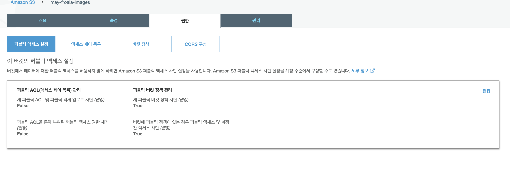

# Froala 에디터를 이용한 간단한 블로그

## 개발 환경
* rails : 5.2
* ruby : 2.4.0
* DB : sqlite

## 시작하기에 앞서
Froala editor를 이용한 이미지 업로드는 다음 단계들로 이루어져 있습니다.
* S3로의 업로드를 도와주는 uploader 만들기
* uploader와 Froala editor를 이용해 이미지 업로드 하기
* S3에 이미지가 등록되었는지 확인하기

## 1. Uploader 만들기
우선 업로드용 이미지들을 디비에서 관리하기 위해 `Attachment` 모델을 만들어 줍니다. (다른 이름으로 만들어도 상관 없습니다.)
```
rails generate model Attachment file:string
rake db:migrate
```
file이란 컬럼에는 이미지의 이름, 업로드 후 생성된 url, S3 내에서의 경로 등등의 정보가 담기게 됩니다.

attachment.rb 파일을 열고 다음과 같이 입력해줍니다.
```ruby
class Attachment < ApplicationRecord
  mount_uploader :file, S3Uploader
end
```
그리고 이젠 S3Uploader 를 만들어 주면 됩니다. app 폴더 내에 uploaders 라는 폴더를 만들고 그 안에 s3_uploader.rb 파일을 만들어 줍니다. 안의 코드는 다음과 같습니다.
```ruby
class S3Uploader < CarrierWave::Uploader::Base
  # Include RMagick or MiniMagick support:
  # include CarrierWave::RMagick
  include CarrierWave::MiniMagick

  # Choose what kind of storage to use for this uploader:
  # storage :file
  storage :fog

  # Override the directory where uploaded files will be stored.
  # This is a sensible default for uploaders that are meant to be mounted:
  def store_dir
    "uploads/#{model.class.to_s.underscore}/#{mounted_as}/#{model.id}"
  end

  # Provide a default URL as a default if there hasn't been a file uploaded:
  # def default_url(*args)
  #   # For Rails 3.1+ asset pipeline compatibility:
  #   # ActionController::Base.helpers.asset_path("fallback/" + [version_name, "default.png"].compact.join('_'))
  #
  #   "/images/fallback/" + [version_name, "default.png"].compact.join('_')
  # end

  # Process files as they are uploaded:
  # process scale: [200, 300]
  #
  # def scale(width, height)
  #   # do something
  # end

  # Create different versions of your uploaded files:
  # version :thumb do
  #   process resize_to_fit: [50, 50]
  # end

  # Add a white list of extensions which are allowed to be uploaded.
  # For images you might use something like this:
  def extension_whitelist
    %w(jpg jpeg gif png)
  end

  # Override the filename of the uploaded files:
  # Avoid using model.id or version_name here, see uploader/store.rb for details.
  # def filename
  #   "something.jpg" if original_filename
  # end
end
```
store_dir 함수의 경우 상황에 맞게 바꿔 주시면 됩니다. 

다음으로 AWS 계정 정보를 넣어야합니다. 저의 경우는 `config/initializers/fog.rb`에 넣어주었는데 상황에 맞게 넣으시면 됩니다. fog_directory는 S3의 버킷 이름을 넣으시면 됩니다.

## 2. 업로드를 위한 controller 만들기
Froala Editor에서 이미지를 업로드할 때 POST method의 Http request를 하게 됩니다. 이때 사용하게 될 URL을 만들어 주기위해 `attachments_controller.rb`를 만들고 `routes.rb`에 url을 등록하면 됩니다.

```ruby
class AttachmentsController < ApplicationController
  #skip_before_filter :verify_authenticity_token  #open when skip csrf token verify
  def index
    @attachment = Attachment.new
  end
  
  def show
    @attachment = Attachment.find(1)
  end
  
  def upload
    @attachment = Attachment.new
    @attachment.file = params[:file]
    @attachment.save
    
    respond_to do |format|
        format.json { render :json => { status: 'OK', link: @attachment.file.url}}
    end
  end

  def create
    @attachment = Attachment.create(attachment_params)
    render :show
  end

  def destroy 
    file = Attachment.find(params[:id]) 
    file.destroy head :ok 
  rescue ActiveRecord::RecordNotFound 
    head :no_content 
  end 
  
  private
    def attachment_params
      params.require(:attachment).permit(:file)
    end
end
```

```ruby
# routes.rb
delete 'attachments/destroy' => 'attachments#destroy' 
  resources :attachments, only: [:index, :create, :destroy] do 
    collection do 
      post :upload 
    end 
  end
```

## 3. 이미지가 업로드 되는지 확인
코드를 작성하고 테스트를 통해 S3로 이미지가 업로드 되는지 확인합니다. 코드에 이상이 없는데도 이미지가 업로드 되지 않는다면 S3 버킷의 권한을 한번 확인해주세요.




새 퍼블릭 ACL 및 퍼블릭 객체 업로드 차단(권장) -> False, 
퍼블릭 ACL을 통해 부여된 퍼블릭 엑세스 권한 제거(권장) -> False,
나머지는 True

